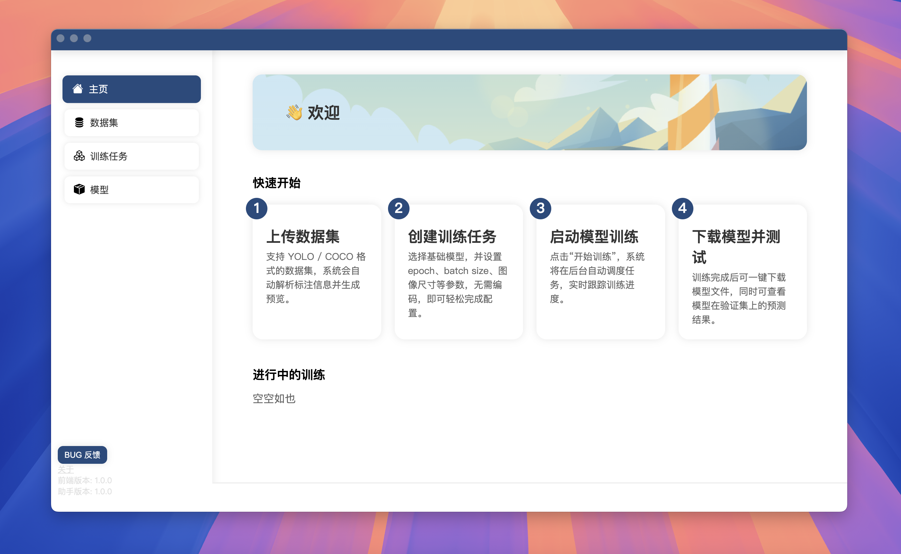
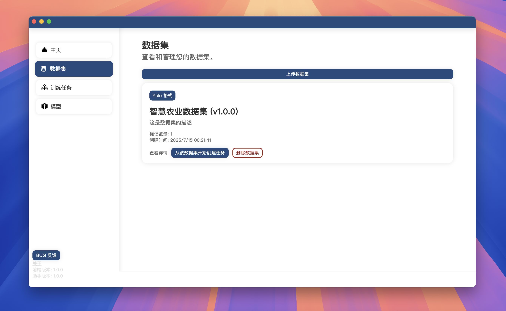
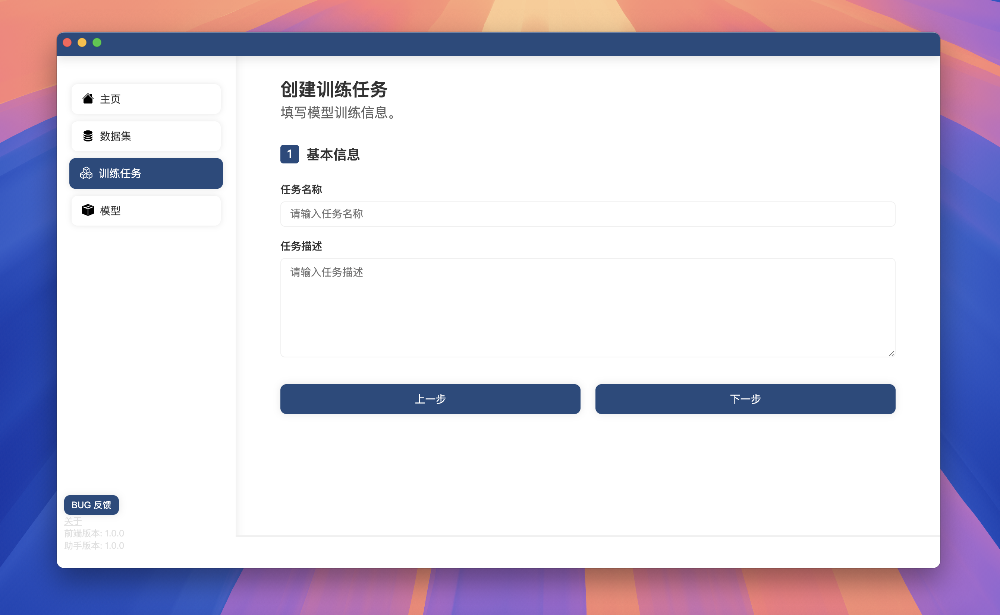
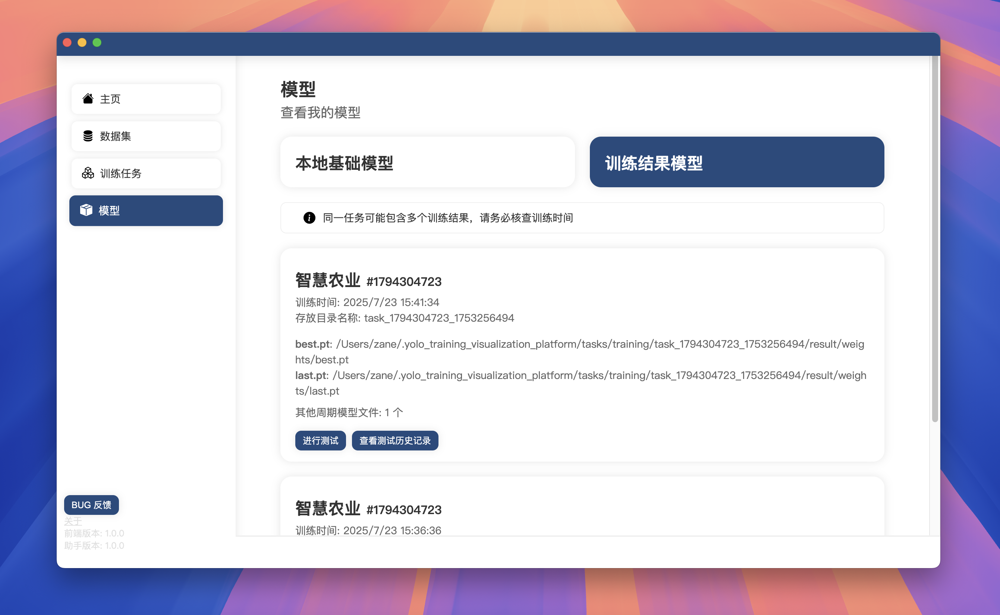

<div align="center">

# YOLO 可视化训练平台

#### 一个基于 Electron + Flask 的跨平台 YOLO 模型训练可视化工具，支持数据集上传、模型训练、训练进度监控、模型测试及结果可视化，旨在降低视觉学习检测任务的入门门槛。

简体中文 · [English](./README_en.md)

</div>

[](https://nodejs.org/)
[](https://www.python.org/)
[](LICENSE)
[](https://github.com/Zim9729/YoloTrainingVisualizationPlatform/releases)

## 🖼️ 截图

<table>
  <tr>
    <td></td>
    <td></td>
  </tr>
  <tr>
    <td></td>
    <td></td>
  </tr>
</table>

## ✨ 功能

- 页面简洁，快速易上手
- 支持 YOLO、COCO 等多种格式数据
- 可视化设置训练参数（epoch、batch size、图像尺寸等）
- 支持选择基础模型进行迁移学习
- 可视化展示训练日志、损失变化、mAP 等关键指标
- 支持多任务并行训练
- 支持上传图片路径进行单图推理测试
- 完全本地运行，无需依赖云平台

## 📦 安装说明

### 前置依赖

- Node.js >= 20
- Python >= 3.9
- pip + uv

### 克隆项目

```bash
git clone https://github.com/Zim9729/YoloTrainingVisualizationPlatform.git
cd YoloTrainingVisualizationPlatform
```

### 安装后端依赖

```bash
cd backend
pip install uv
uv venv
source .venv/bin/activate  # Linux/macOS
.venv\Scripts\activate     # Windows
uv pip install -r requirements.txt -i https://pypi.tuna.tsinghua.edu.cn/simple
```

### 安装前端依赖

```bash
cd frontend
yarn install
```

## 🚀 启动项目

### 开发

**前端（Vite）**

```bash
cd frontend
yarn dev
```

**APP（Electron）**

```bash
cd app
yarn dev
```

### 打包

```bash
cd frontend
yarn build

cd backend
# 运行前，请先将main.py中的debug改为False
pyinstaller --onefile main.py

cd app
yarn build
```

## 📁 项目结构简览

```
Yolo_Training_Visualization_Platform/
├── backend/                   # Python 后端（Flask + 多线程任务调度）
│   ├── ITraining/             # 训练任务蓝图
│   ├── IModel/                # 模型蓝图
│   ├── IDataset/              # 数据集蓝图
│   └── ...
├── frontend/                  # React 前端界面
│   └── ...
├── app/                       # Electron
│   └── ...
└── README.md 
```

## 🧩 系统架构

- 前端（`frontend/`）：基于 React + Vite，默认开发端口 `5173`，通过 `src/api.js` 使用 `src/config.js` 中的 `API_BASE_URL` 访问后端（默认 `http://localhost:10799`）。
  - 支持通过环境变量覆盖：在 `frontend/.env.development`、`frontend/.env.production` 中设置 `VITE_API_BASE_URL`。
- 后端（`backend/`）：基于 Flask，主入口 `backend/main.py`，注册三个蓝图：
  - `IDataset`（`backend/IDataset/routes.py`）：数据集导入、统计与校验
  - `ITraining`（`backend/ITraining/`）：训练任务管理与 YOLO 训练主流程
  - `IModel`（`backend/IModel/routes.py`）：训练结果模型的推理与可视化
- 桌面端（`app/`）：Electron 外壳，开发模式加载 `http://localhost:5173`，打包后加载 `resources/frontend/index.html`。

后端运行时的默认数据目录（见 `backend/config.py`，按需修改）：

- 数据集目录：`~/.yolo_training_visualization_platform/dataset`
- 任务目录：`~/.yolo_training_visualization_platform/tasks`
- 模型目录：`~/.yolo_training_visualization_platform/models`
- 训练结果元数据：`~/.yolo_training_visualization_platform/tasks_result_files`
- 测试结果元数据：`~/.yolo_training_visualization_platform/test_result_files`

后端版本接口：`GET /info`，当前版本 `1.0.0`。前端在 `src/config.js` 的 `SUPPORTED_BACKEND_VERSIONS` 中做版本兼容检查。

## 🔌 后端 API 概览（节选）

- `GET /`：健康检查（返回 `OK`）
- `GET /info`：返回后端版本
- `IDataset` 模块（见 `backend/IDataset/routes.py`）：
  - 解析 YOLO/COCO 数据集 yaml/json，统计图片与标注数量
  - 数据集打包上传/解压、基础校验等
  - Label Studio 集成：
    - `GET /IDataset/listLabelStudioProjects?base_url=...&token=...`：列出项目（token 可选）
    - `POST /IDataset/buildDatasetFromLabelStudio`：从项目拉取标注并一键构建 YOLO 数据集
      - Body JSON 关键字段：`base_url`(必填)、`token`(可选)、`project_id`(必填)、`name`、`version`、`splits`(如 `[0.8,0.2,0.0]`)、`download_images`、`class_names`
- `ITraining` 模块（见 `backend/ITraining/routes.py`）：
  - `GET /ITraining/getAllTasks`：列出任务配置（`tasks/*.yaml`）
  - `GET /ITraining/getTask?filename=...`：读取单个任务配置
  - 训练启动与状态查询、训练日志与曲线数据获取（支持多任务并行）
- `IModel` 模块（见 `backend/IModel/routes.py`）：
  - `POST /IModel/runModelTest`：发起推理任务（单图/视频）
  - `POST /IModel/runModelValidation`：发起模型验证任务（指定 `datasetYamlPath`、`modelType` 等）
  - `GET /IModel/getTaskLog`：测试任务日志轮询
  - `GET /IModel/getValTaskLog`：验证任务日志轮询
  - `POST /IModel/uploadTestInput`：上传测试图片（浏览器环境下使用 multipart 表单）
  - 任务列表保存/加载、推理结果文件索引与下载

提示：各接口返回统一结构（`tools/format_output.py`），前端通过 `src/api.js` 包装 `fetch` 访问。

OpenAPI 文档：参见仓库根目录的 `openapi.yaml`（可导入 Swagger UI/Insomnia/Postman 查看）。

## 🗂️ 数据集与任务配置

本平台兼容 YOLO 与 COCO 两种主流格式。建议优先使用 YOLO 格式。

- YOLO 样例 `dataset.yaml`（位于数据集根）：

```yaml
path: /abs/path/to/dataset
train: images/train
val: images/val
test: images/test  # 可选
names: [cat, dog]
nc: 2
```

- COCO 样例（关键文件位置）：
  - `train/`、`val/` 下图片
  - `annotations/instances_train.json`、`annotations/instances_val.json`

任务配置文件存放在：`~/.yolo_training_visualization_platform/tasks/*.yaml`。训练模块（`backend/ITraining/train.py`）会读取任务配置与数据集平台信息文件 `yolo_training_visualization_info.yaml`。

常见任务参数（对应 `frontend/src/config.js` 的 `TASK_CONFIGURATiON_ITEMS`）：

- `taskName`、`taskDescription`
- `datasetPath`（指向数据集根目录）
- `trainingType`（0：微调；1：从头构建）
- `epochs`、`batchSize`、`imgSize`
- `device`（cpu/gpu/mps 等）与 `gpuCUDAIndex`、`gpuCUDANum`
- `trainSeed`、`cache`、`modelYamlFile`、`baseModelID`

模型文件说明（节选，自 `frontend/src/config.js` 的 `MODEL_EXPLANATION`）：

- `weights/best.pt`：验证集最佳，推荐用于推理
- `weights/last.pt`：最后一个 epoch 权重，便于继续训练
- `args.yaml`、`results.csv`：训练参数与指标记录

## ⚡ 快速开始（本地开发）

1. 启动后端（默认端口 10799）：

```bash
cd backend
python main.py
```

2. 启动前端（Vite 默认 5173）：

```bash
cd frontend
yarn dev
```

3. 启动桌面端（可选，开发模式会加载本地 5173）：

```bash
cd app
yarn dev
```

4. 打开应用，按引导创建或选择数据集，配置训练任务，启动训练；在「测试」页选择 `best.pt` 进行单图/视频推理与结果可视化。

## 🛠️ 打包与发布建议

- 后端可使用 `pyinstaller` 生成单文件可执行（注意在 `backend/main.py` 中将 `debug=True` 改为 `False`）。
- Electron 使用 `electron-builder`，会将 `resources/backend` 一并打包到应用资源目录（见 `app/package.json` 的 `extraResources`）。
- 前端需先 `yarn build`，将产物复制/打包到 Electron 的 `resources/frontend/` 路径。

## ❓ 常见问题与排错

- 端口冲突：
  - 后端默认 `10799`，可在 `backend/main.py` 修改 `app.run(..., port=10799)`。
  - 前端默认 `5173`，可在 `frontend/vite.config.js` 中调整开发端口。
- 模型下载慢：
  - 训练时会按需下载基础模型（见 `backend/ITraining/train.py` 的 `download_model()`），可提前将模型放到 `~/.yolo_training_visualization_platform/models/base/`。
- CUDA 不可用/驱动不匹配：
  - 请确保本地 PyTorch 与 CUDA 版本匹配。必要时将设备改为 `cpu` 或 `mps`。
- 数据集无法识别：
  - 核查 `dataset.yaml` 字段：`path/train/val/test/names/nc`；或 COCO 的 `annotations` 路径。
- 跨平台路径分隔：
  - 平台内部已尽量做兼容（如 `pathlib.Path`），建议在 yaml 中尽量使用相对路径并指定 `path` 为根。

## 💡 开发建议

- 统一返回结构：后端使用 `tools/format_output.py` 封装响应；前端统一经由 `src/api.js` 调用。
- 日志与进度：训练使用 `tqdm`、自定义 `StreamToLogger` 与队列处理器（见 `backend/ITraining/handlers.py`），便于前端消费。
- 版本协同：更新后端 `GET /info` 版本时，同步更新前端 `SUPPORTED_BACKEND_VERSIONS` 以避免不兼容。

## 🗺️ 路线图

- [ ] 训练过程更丰富的可视化（lr、各损失分项、PR 曲线）
- [ ] 断点续训、任务克隆与对比
- [ ] 更多数据集格式支持与自动转换
- [ ] 模型导出（ONNX/TensorRT/OpenVINO）与部署助手


## 🤝 贡献指南

欢迎提交 PR 或 issue！你可以：

* 提交 bug 报告
* 增加新的功能模块
* 提出 UI/UX 优化建议

## 📄 许可证

本项目采用 [MIT License](LICENSE)。

## 🧠 灵感与鸣谢

* [Ultralytics](https://github.com/ultralytics/)
* [Electron](https://www.electronjs.org/)
* [Vite](https://vitejs.dev/)
* [Flask](https://flask.palletsprojects.com/)

## 📫 联系方式

* 📧 Email: [slxzane@outlook.com](mailto:slxzane@outlook.com)
* 🌐 Github: [@chzane](https://github.com/chzane)
