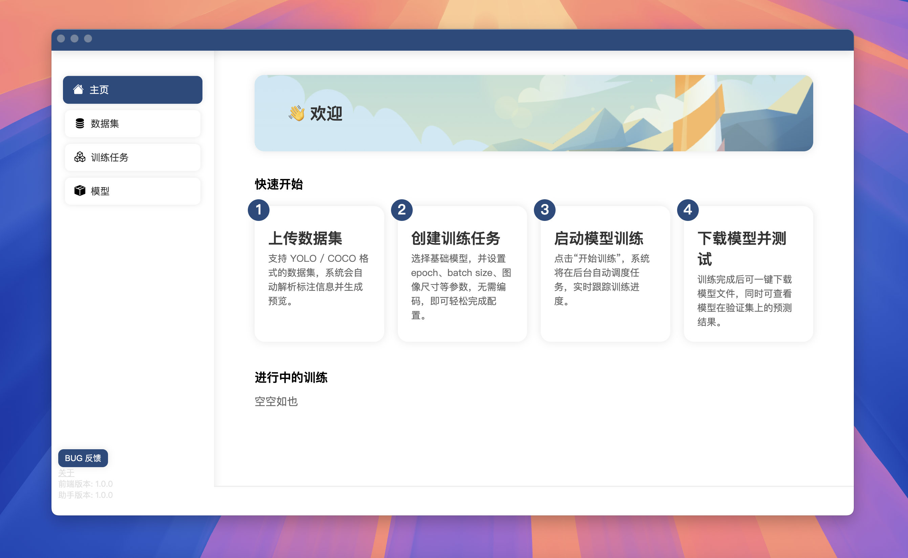
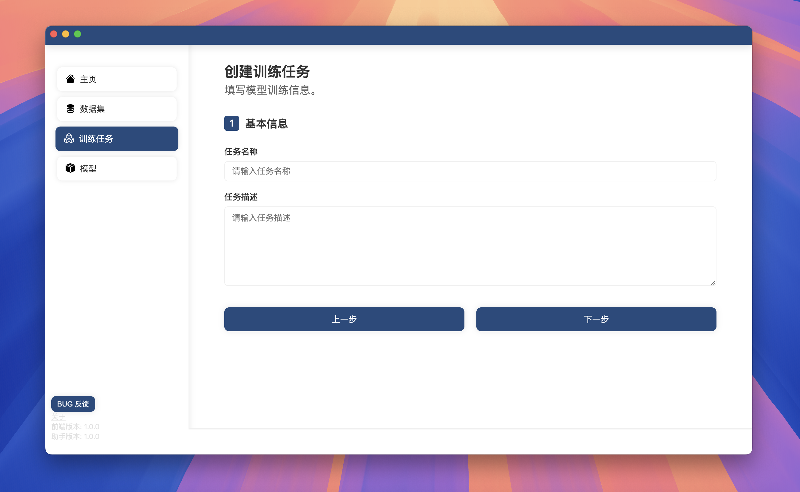

<div align="center">

# YOLO Visualization Training Platform

#### A cross-platform YOLO model training visualization tool based on Electron + Flask, supporting dataset upload, model training, training progress monitoring, model testing, and result visualization. It aims to lower the entry barrier for visual learning detection tasks.

[简体中文](./README.md) · English

</div>

[](https://nodejs.org/)
[](https://www.python.org/)
[](LICENSE)
[](https://github.com/Zim9729/YoloTrainingVisualizationPlatform/releases)

## 🖼️ Screenshots

<table>
  <tr>
    <td></td>
    <td></td>
  </tr>
  <tr>
    <td></td>
    <td></td>
  </tr>
</table>

## ✨ Features

- Simple interface, quick and easy to use
- Supports multiple data formats such as YOLO and COCO
- Visual configuration of training parameters (epoch, batch size, image size, etc.)
- Supports selecting base models for transfer learning
- Visual display of training logs, loss changes, mAP, and other key metrics
- Supports multi-task parallel training
- Supports single image inference testing by uploading image paths
- Fully local operation, no reliance on cloud platforms

## 📦 Installation Instructions

### Prerequisites

- Node.js >= 20
- Python >= 3.9
- pip + uv

### Clone the Project

```bash
git clone https://github.com/Zim9729/YoloTrainingVisualizationPlatform.git
cd YoloTrainingVisualizationPlatform
```

### Install Backend Dependencies

```bash
cd backend
pip install uv
uv venv
source .venv/bin/activate  # Linux/macOS
.venv\Scripts\activate     # Windows
uv pip install -r requirements.txt -i https://pypi.tuna.tsinghua.edu.cn/simple
```

### Install Frontend Dependencies

```bash
cd frontend
yarn install
```

## 🚀 Start the Project

### Development

**Frontend (Vite)**

```bash
cd frontend
yarn dev
```

**APP (Electron)**

```bash
cd app
yarn dev
```

### Build

```bash
cd frontend
yarn build

cd backend
# Before running, change debug in main.py to False
pyinstaller --onefile main.py

cd app
yarn build
```

## 📁 Project Structure Overview

```
Yolo_Training_Visualization_Platform/
├── backend/                   # Python backend (Flask + multithreading task scheduling)
│   ├── ITraining/             # Training task blueprint
│   ├── IModel/                # Model blueprint
│   ├── IDataset/              # Dataset blueprint
│   └── ...
├── frontend/                  # React frontend interface
│   └── ...
├── app/                       # Electron
│   └── ...
└── README.md 
```

## 🧩 Architecture

- Frontend (`frontend/`): React + Vite. Dev server runs at `5173`. HTTP calls are centralized in `src/api.js`, using `API_BASE_URL` from `src/config.js` (default `http://localhost:10799`).
- Backend (`backend/`): Flask app with three blueprints registered in `backend/main.py`:
  - `IDataset` (`backend/IDataset/routes.py`): dataset import, statistics and validation
  - `ITraining` (`backend/ITraining/`): training task management and YOLO training workflow
  - `IModel` (`backend/IModel/routes.py`): inference and visualization on trained models
- Desktop (`app/`): Electron shell. Dev mode loads `http://localhost:5173`, production loads `resources/frontend/index.html`.

Runtime data directories (see `backend/config.py`, can be customized):

- Datasets: `~/.yolo_training_visualization_platform/dataset`
- Tasks: `~/.yolo_training_visualization_platform/tasks`
- Models: `~/.yolo_training_visualization_platform/models`
- Training result metadata: `~/.yolo_training_visualization_platform/tasks_result_files`
- Test result metadata: `~/.yolo_training_visualization_platform/test_result_files`

Backend version endpoint: `GET /info`, current `1.0.0`. The frontend checks compatibility via `SUPPORTED_BACKEND_VERSIONS` in `src/config.js`.

## 🔌 Backend API Overview (excerpt)

- `GET /`: health check (`OK`)
- `GET /info`: backend version
- `IDataset` (see `backend/IDataset/routes.py`): YAML/JSON parsing for YOLO/COCO, counts of images/labels, dataset upload and validation
  - Label Studio integration:
    - `GET /IDataset/listLabelStudioProjects?base_url=...&token=...`: list projects (token optional)
    - `POST /IDataset/buildDatasetFromLabelStudio`: build a YOLO dataset from a project
      - Body JSON keys: `base_url`(required), `token`(optional), `project_id`(required), `name`, `version`, `splits` (e.g. `[0.8,0.2,0.0]`), `download_images`, `class_names`
- `ITraining` (see `backend/ITraining/routes.py`): list/read tasks, start training, query status, fetch logs/artifacts (supports concurrent tasks)
- `IModel` (see `backend/IModel/routes.py`): run inference task (image/video), list tests, fetch results

All endpoints return a unified structure (see `tools/format_output.py`). Frontend uses `src/api.js` to wrap `fetch` calls.

OpenAPI spec: see `openapi.yaml` at repository root (import into Swagger UI / Insomnia / Postman).

## 🗂️ Dataset & Task Configuration

The platform supports YOLO and COCO formats. YOLO is recommended.

- YOLO `dataset.yaml` example:

```yaml
path: /abs/path/to/dataset
train: images/train
val: images/val
test: images/test  # optional
names: [cat, dog]
nc: 2
```

- COCO layout (key files):
  - images under `train/`, `val/`
  - annotations at `annotations/instances_train.json`, `annotations/instances_val.json`

Task files are saved at: `~/.yolo_training_visualization_platform/tasks/*.yaml`.
The training module (`backend/ITraining/train.py`) reads task config and dataset platform info file `yolo_training_visualization_info.yaml` from the dataset root.

Common task parameters (aligned with `frontend/src/config.js#TASK_CONFIGURATiON_ITEMS`):

- `taskName`, `taskDescription`
- `datasetPath` (dataset root)
- `trainingType` (0: finetune; 1: from-scratch)
- `epochs`, `batchSize`, `imgSize`
- `device` (cpu/gpu/mps) with `gpuCUDAIndex`, `gpuCUDANum`
- `trainSeed`, `cache`, `modelYamlFile`, `baseModelID`

Model artifacts (excerpt from `frontend/src/config.js#MODEL_EXPLANATION`):

- `weights/best.pt`: best on validation, recommended for inference
- `weights/last.pt`: last epoch, good for resume
- `args.yaml`, `results.csv`: params and metrics

## ⚡ Quickstart (local dev)

1) Start backend (port 10799):

```bash
cd backend
python main.py
```

2) Start frontend (Vite at 5173):

```bash
cd frontend
yarn dev
```

3) Start Electron app (optional, loads 5173 in dev):

```bash
cd app
yarn dev
```

## 🛠️ Packaging & Release Tips

- Use `pyinstaller` to build backend single executable (set `debug=False` in `backend/main.py`).
- Electron uses `electron-builder`. `resources/backend` is included via `extraResources` (see `app/package.json`).
- Build frontend with `yarn build` and bundle output under Electron `resources/frontend/`.

## ❓ Troubleshooting

- Port conflicts:
  - Backend `10799` (change in `backend/main.py`)
  - Frontend `5173` (change in `frontend/vite.config.js`)
- Slow model downloads:
  - Training may download base models on demand (`download_model()` in `backend/ITraining/train.py`). You can pre-place models in `~/.yolo_training_visualization_platform/models/base/`.
- CUDA not available / driver mismatch:
  - Ensure PyTorch and CUDA versions match. Use `cpu` or `mps` as fallback.
- Dataset issues:
  - Check `dataset.yaml` fields (`path/train/val/test/names/nc`) or COCO annotation paths.
- Cross-platform paths:
  - Internally we use `pathlib` where possible; prefer relative paths in YAML with a proper `path` root.

## 💡 Development Tips

- Unified response format (`tools/format_output.py`), unified API client (`frontend/src/api.js`).
- Logs & progress via `tqdm` and custom `StreamToLogger` with queue handler (see `backend/ITraining/handlers.py`).
- Version sync: when updating backend `GET /info`, also update frontend `SUPPORTED_BACKEND_VERSIONS`.

## 🗺️ Roadmap

- [ ] Richer training visualizations (lr, loss breakdowns, PR curves)
- [ ] Resume training, task cloning & comparison
- [ ] More dataset formats and auto conversion
- [ ] Model export (ONNX/TensorRT/OpenVINO) and deployment helper

## 🤝 Contribution Guide

Contributions via PR or issue are welcome! You can:

* Submit bug reports
* Add new feature modules
* Suggest UI/UX improvements

## 📄 License

This project is licensed under the [MIT License](LICENSE).

## 🧠 Inspiration and Acknowledgments

* [Ultralytics](https://github.com/ultralytics/)
* [Electron](https://www.electronjs.org/)
* [Vite](https://vitejs.dev/)
* [Flask](https://flask.palletsprojects.com/)

## 📫 Contact

* 📧 Email: [slxzane@outlook.com](mailto:slxzane@outlook.com)
* 🌐 Github: [@chzane](https://github.com/chzane)
